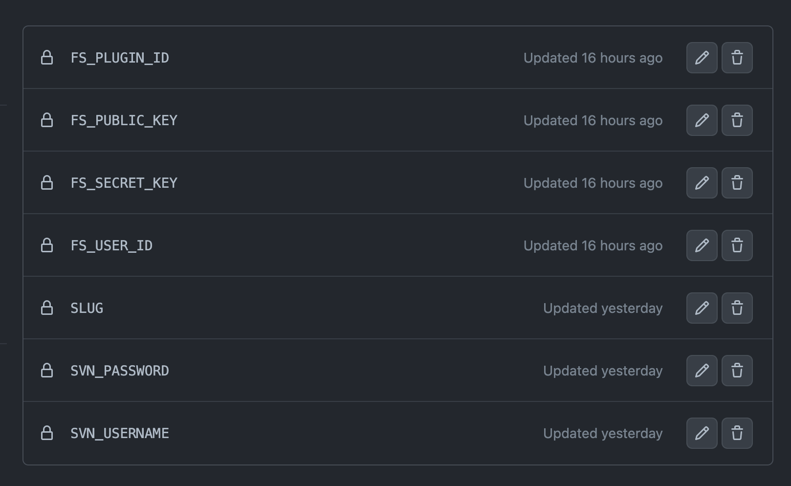
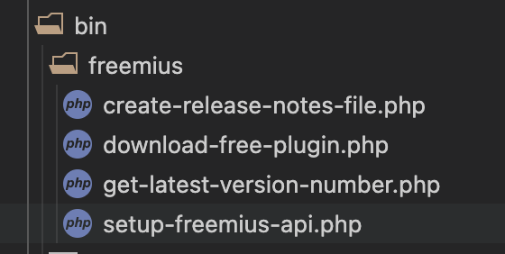
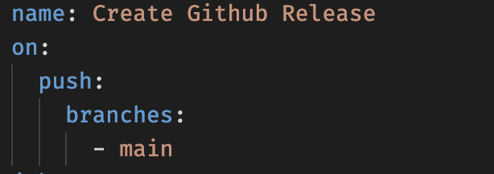

# What it does

Deploys the free version of a plugin uploaded on freemius to wp.org. 

# Note

Before using this workflow on a new Github respository, you need to give workflows the permissions to read and write files during actions.

To do that go to the respository settings, and set the "Workflow permissions" to "Read and write permissions"

[Worflow Permissions setting](./screenshots/workflow-permissions.png). 

# Applicable workflows

If your workflow is similar to the one detailed below, then this repo might prove useful to you. Regardless, the github actions can be changed to suit your specific workflow (example if you just need the freemius->wp.org workflow). 

***Assumed workflow:***

- You have a private github repository where you keep your codebase. 
- You have a local dist script that wraps up and zips up your plugin files which you then upload to Freemius. The `sample-dist.sh` inside the bin folder is an example of such a script.
- You then upload the zip file to Freemius.com deployment (manually) and download a copy of the free/pro versions to do a smoke test.
- Once you're satisfied that everything is fine, you turn the deployment to "released" inside freemius.
- You merge the `development` branch on your private repo into the `main`/`master` (production) branch
- You cross your fingers that your latest release doesn't break user's websites.

# Tasks performed by the workflows

`create-release.yml` creates a tag and release when you merge into your main branch with the commit title containing `release-me` (this can be changed in the workflow)

The tag and release contains your working codebase, not the altered Freemius version (freemius workflow happens later).

Once the release is created and tagged, the `upload-to-svn-from-freemius.yml` workflow is called, this workflow is only called if `create-release.yml` actions completed with no issues.

`upload-to-svn-from-freemius.yml` is then responsible for the following:

- Clone the Freemius PHP SDK.
- Download the free version of the plugin from Freemius.
- Extract the zip the downloaded free version.
- Upload the files to the SVN repository.

# Getting Started

## Setting Github Repository Secrets
\
You need to set a few **Secrets** on the repository needed by the scripts. This will allow the scripts to access the needed info without it needing to be exposed in the sourcecode. [Learn more](https://docs.github.com/en/actions/security-guides/encrypted-secrets#creating-encrypted-secrets-for-a-repository).

### The needed secrets are:
\
`FS_USER_ID` - Your Freemius Developer ID; Can be found at the bottom of your "My Profile" area on Freemius.com

`FS_PLUGIN_ID` - The ID of the plugin that the repo is responsible for; Can be found on the **Settings** page of the **plugin** on Freemius.com.

`FS_PUBLIC_KEY` - Your Freemius Developer Public Key; Can be found at the bottom of your "My Profile" area on Freemius.com

`FS_SECRET_KEY` - Your Freemius Developer Secret Key; Can be found at the bottom of your "My Profile" area on Freemius.com

`SLUG` - The wp.org repo url. Example for `https://wordpress.org/plugins/example-plugin` the `SLUG` would be `example-plugin`

`SVN_PASSWORD` - Your SVN password. The same password you use to log into WP.org.

`SVN_USERNAME` - Your WP.org profile name. [See here](./screenshots/svn-username.png). 

---

\
In the end your repo should have **at least** these secrets:

## Copying needed files to your own repo

The github actions are located in the `workflows` folder of this repo. Simply copy them to your `.github\workflows` directory in your plugin repository.

The scripts fired and needed by the actions are located in the `bin` folder of this repository. You need to reflect the same directory structure in your plugin or else the actions will fail when trying to access the scripts. That is, your plugin structure should look like this:

Feel free to rename the files and change their location, but be sure to make the changes to their references as well.

## Final step

Simply commit and push your changes to github. The actions will run when you merge a pull request into your `main` branch. If you're using a different name for your main branch such as `master`, then change the reference inside `create-release.yml`: 

## Debug

If you'd like to see what would happen before the action actually to pushes to WP.org, you can exit the script after the extraction and normalizing step inside the `download-free-plugin.php` file (`Download_Free_Plugin::extract_plugin_archive()`).

## Props

Finding the right Freemius API endpoint to query, and the needed method for building the authenticated download URL was a challenge. I was able to figure those out by combing through the [Freemius Suite](https://github.com/CodeAtCode/freemius-suite) by Daniele Scasciafratte. 

Check out that library if you'd like to be able to upload directly to freemius and wp.org without the use of Github actions.